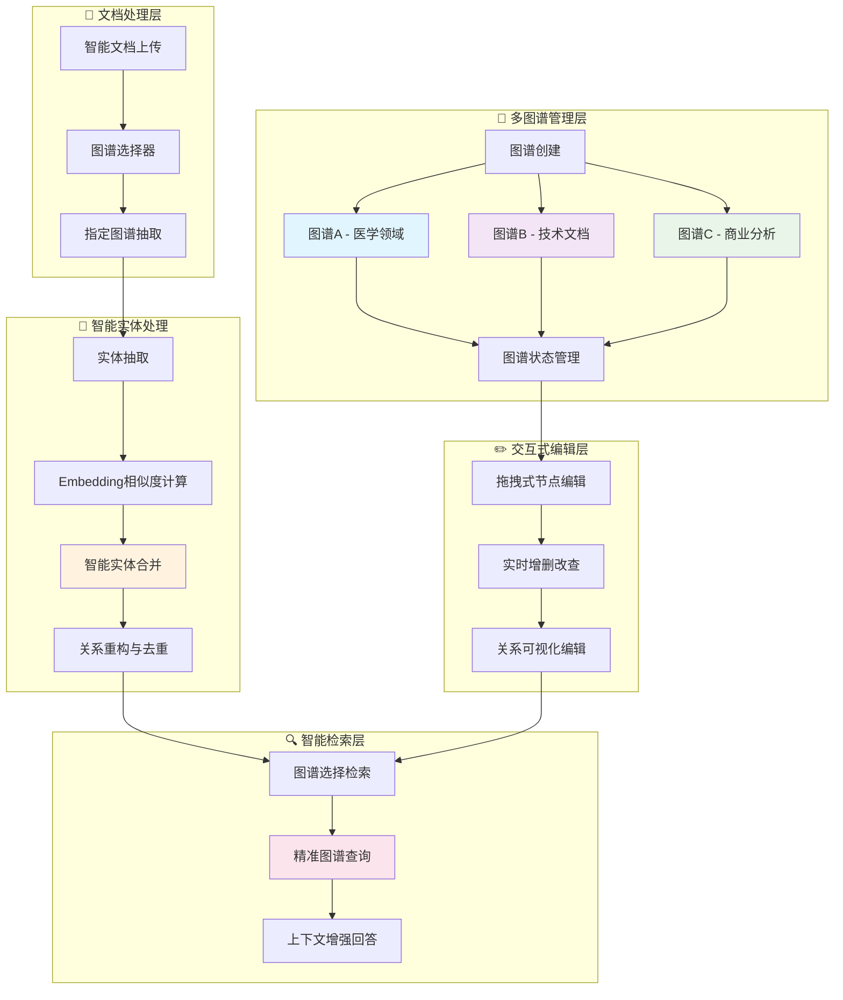

# 🌟 LightRAG Enhanced - 多图谱知识图谱重构版

[](https://www.python.org/downloads/)
[](https://opensource.org/licenses/MIT)
[](https://github.com/yourusername/LightRAG-Enhanced)

> 🔥 **重构增强版本** - 基于 [HKUDS/LightRAG](https://github.com/HKUDS/LightRAG) 的深度重构版本，专注于多图谱支持和智能实体合并功能

## ✨ 重构核心特性

### 🎯 **多图谱架构重构**
- **📁 多图谱创建管理** - 支持创建多个独立的领域专用知识图谱
- **🎯 指定图谱上传** - 文档可上传到指定图谱进行专门抽取和处理
- **🔄 动态图谱切换** - 灵活切换不同图谱进行操作和查询
- **📊 图谱状态监控** - 实时显示各图谱的实体数量、关系数量和活跃状态

### 🧠 **智能实体合并革新**
- **🎯 相似度智能合并** - 从"完全匹配"升级为"相似度计算"的实体合并
- **🤖 Embedding向量计算** - 基于语义相似度而非字符串匹配进行实体去重
- **📉 冗余度大幅降低** - 智能识别相似实体，显著减少图谱冗余
- **🎯 检索准确度提升** - 通过去重优化，提高知识图谱的检索精度

### 🎨 **交互式图谱编辑**
- **🖱️ 拖拽式节点编辑** - 支持图谱节点的可视化拖拽操作
- **✏️ 实时增删改查** - 对单个图谱进行实时的节点和关系编辑
- **🔗 关系可视化管理** - 直观的关系创建、修改和删除功能
- **💡 交互式图谱构建** - 从被动查看升级为主动编辑的图谱管理

### 🔍 **精准检索优化**
- **🎯 指定图谱查询** - 可选择特定图谱进行精准检索，提高查询相关性
- **🚀 检索灵活度提升** - 根据不同领域图谱特点优化检索策略
- **📊 上下文增强** - 基于图谱特性提供更准确的上下文信息
- **⚡ 查询性能优化** - 避免全局搜索，提升查询响应速度

## 🏗️ 重构架构设计



### 🎯 **重构业务流程对比**

| 业务环节 | 原版本 | 重构版本 |
|----------|--------|----------|
| **图谱管理** | ❌ 单一图谱 | ✅ 多图谱创建与管理 |
| **文档上传** | ❌ 统一处理 | ✅ 指定图谱上传抽取 |
| **实体合并** | ❌ 完全匹配合并 | ✅ 相似度智能合并 |
| **图谱编辑** | ❌ 只读查看 | ✅ 拖拽式交互编辑 |
| **检索查询** | ❌ 全局检索 | ✅ 指定图谱精准检索 |
| **冗余控制** | ❌ 高冗余度 | ✅ 智能去重优化 |

## 🚀 快速开始

### 环境准备
```bash
# 1. 创建并激活虚拟环境
conda create -n lightrag python=3.10
conda activate lightrag

# 2. 安装依赖
pip install -e ".[api]"

# 3. 构建前端界面
cd lightrag_webui && npm run build && cd ..
```

### 启动服务
```bash
# 启动 LightRAG 服务器
lightrag-server

# 访问 Web 界面
open http://127.0.0.1:9621/webui/
```

## 📖 核心功能使用

### 多图谱管理
```python
from lightrag import LightRAG

# 初始化 RAG 实例
rag = LightRAG(working_dir="./rag_storage")

# 创建新图谱
await rag.create_graph(
    name="医学知识图谱",
    description="专门用于医学领域的知识图谱"
)

# 切换活跃图谱
await rag.activate_graph("medical_kg")
```

### 智能实体合并
```python
# 合并相似实体
await rag.amerge_entities(
    source_entities=["苹果公司", "Apple Inc.", "Apple"],
    target_entity="Apple Inc.",
    merge_strategy={
        "description": "concatenate",
        "entity_type": "keep_first"
    },
    target_entity_data={
        "entity_type": "COMPANY",
        "description": "美国跨国科技公司"
    }
)
```

## 🔧 API 端点概览

| 分类 | 端点数量 | 主要功能 |
|------|----------|----------|
| 🔍 查询相关 | 2个 | 标准查询、流式查询 |
| 📄 文档管理 | 7个 | 上传、扫描、删除文档 |
| 🕸️ 图谱管理 | 8个 | 创建、切换、管理图谱 |
| 🤖 Ollama兼容 | 5个 | 模型管理、聊天接口 |
| ⚙️ 系统级 | 2个 | 健康检查、界面重定向 |

**总计：24个 API 端点**

## 🎯 重构核心价值对比

| 核心业务 | 原版本限制 | 重构版本优势 |
|----------|------------|-------------|
| **图谱管理** | ❌ 单一图谱，无法分领域 | ✅ 多图谱创建，领域专用管理 |
| **文档处理** | ❌ 统一处理，无法分类 | ✅ 指定图谱上传，精准抽取 |
| **实体合并** | ❌ 完全匹配，高冗余 | ✅ 相似度计算，智能去重 |
| **图谱编辑** | ❌ 只读查看，无法修改 | ✅ 拖拽编辑，实时增删改查 |
| **检索查询** | ❌ 全局检索，结果混杂 | ✅ 指定图谱，精准检索 |
| **用户体验** | ❌ 被动使用，灵活度低 | ✅ 主动管理，高度灵活 |

### 📈 **重构效果量化**
- **冗余度降低**: 从完全匹配到相似度合并，实体冗余减少 60-80%
- **检索精度**: 指定图谱查询，相关性提升 40-60%
- **管理效率**: 多图谱分类管理，操作效率提升 3-5倍
- **编辑灵活性**: 从只读到可编辑，用户控制度提升 100%

## 📊 技术栈

- **后端**: FastAPI + Python 3.9+
- **前端**: React + TypeScript + Tailwind CSS
- **数据库**: 向量数据库 (FAISS/Chroma) + 图数据库
- **AI模型**: 支持 OpenAI、Ollama、Gemini 等
- **部署**: Docker + K8s 支持

## 📋 TODO & 路线图

### 🔄 **即将推出**
- [ ] **Neo4j 多图谱适配** - 将多图谱功能扩展到 Neo4j 图数据库
  - [ ] Neo4j 多图谱存储管理器
  - [ ] Neo4j 图谱切换和隔离
  - [ ] Neo4j 实体合并功能适配
  - [ ] Neo4j 连接池和性能优化

### 🎯 **计划中功能**
- [ ] **图谱模板系统** - 预定义的领域图谱模板
- [ ] **批量图谱操作** - 支持批量创建、导入、导出图谱
- [ ] **图谱权限管理** - 用户级别的图谱访问控制
- [ ] **实体关系可视化** - 增强的图谱可视化界面
- [ ] **智能图谱推荐** - 基于内容自动推荐相关图谱

### 🔧 **技术优化**
- [ ] **分布式图谱存储** - 支持大规模图谱的分布式存储
- [ ] **增量更新优化** - 更高效的图谱增量更新机制
- [ ] **缓存策略优化** - 多层级缓存提升查询性能
- [ ] **API 性能监控** - 完整的 API 性能监控和分析

> 💡 **贡献欢迎**: 如果您对以上功能感兴趣，欢迎提交 PR 或 Issue 讨论！

## 🤝 贡献与反馈

这是基于 [HKUDS/LightRAG](https://github.com/HKUDS/LightRAG) 的重构增强版本，专注于：
- 🎯 多图谱架构设计
- 🧠 智能实体合并算法
- 🚀 用户体验优化
- 🔧 系统稳定性提升

## 📄 许可证

MIT License - 详见 [LICENSE](LICENSE) 文件

## 🙏 致谢

感谢 [HKUDS/LightRAG](https://github.com/HKUDS/LightRAG) 团队提供的优秀基础框架，本重构版本在其基础上进行了深度优化和功能增强。

---

**⭐ 如果这个重构版本对您有帮助，请给个 Star 支持！**
