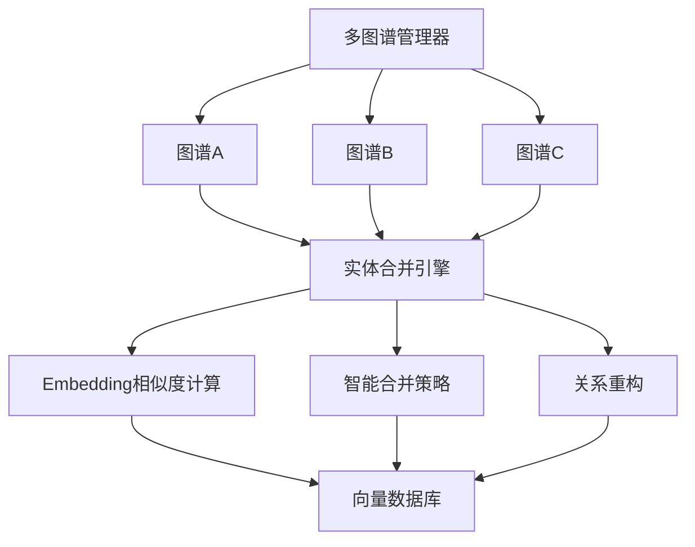

# 🌟 LightRAG Enhanced - 多图谱知识图谱重构版

[](https://www.python.org/downloads/)
[](https://opensource.org/licenses/MIT)
[](https://github.com/yourusername/LightRAG-Enhanced)

> 🔥 **重构增强版本** - 基于 [HKUDS/LightRAG](https://github.com/HKUDS/LightRAG) 的深度重构版本，专注于多图谱支持和智能实体合并功能

## ✨ 重构核心特性

### 🎯 **多图谱架构支持**
- **🔄 动态图谱切换** - 支持在同一系统中管理多个独立知识图谱
- **📊 图谱状态管理** - 实时显示图谱状态、实体数量和活跃状态
- **🎨 可视化界面** - 直观的图谱选择器和状态指示器
- **🔍 跨图谱检索** - 支持指定图谱进行精准检索

### 🧠 **智能实体合并系统**
- **🤖 Embedding相似度合并** - 基于向量相似度的智能实体去重
- **📋 多策略合并** - 支持 `concatenate`、`keep_first`、`keep_last`、`join_unique` 等策略
- **🔗 关系智能合并** - 自动处理合并实体的关系重构和去重
- **⚡ 异步批处理** - 高效的批量实体合并处理

### 🚀 **性能与体验优化**
- **💾 智能缓存系统** - 支持 embedding 缓存和相似度阈值控制
- **🔄 实时状态同步** - 多组件间的图谱状态一致性保证
- **📱 响应式设计** - 优化的移动端和桌面端体验
- **🛡️ 增强错误处理** - 友好的错误提示和异常恢复

## 🏗️ 架构亮点



## 🚀 快速开始

### 环境准备
```bash
# 1. 创建并激活虚拟环境
conda create -n lightrag python=3.10
conda activate lightrag

# 2. 安装依赖
pip install -e ".[api]"

# 3. 构建前端界面
cd lightrag_webui && npm run build && cd ..
```

### 启动服务
```bash
# 启动 LightRAG 服务器
lightrag-server

# 访问 Web 界面
open http://127.0.0.1:9621/webui/
```

## 📖 核心功能使用

### 多图谱管理
```python
from lightrag import LightRAG

# 初始化 RAG 实例
rag = LightRAG(working_dir="./rag_storage")

# 创建新图谱
await rag.create_graph(
    name="医学知识图谱",
    description="专门用于医学领域的知识图谱"
)

# 切换活跃图谱
await rag.activate_graph("medical_kg")
```

### 智能实体合并
```python
# 合并相似实体
await rag.amerge_entities(
    source_entities=["苹果公司", "Apple Inc.", "Apple"],
    target_entity="Apple Inc.",
    merge_strategy={
        "description": "concatenate",
        "entity_type": "keep_first"
    },
    target_entity_data={
        "entity_type": "COMPANY",
        "description": "美国跨国科技公司"
    }
)
```

## 🔧 API 端点概览

| 分类 | 端点数量 | 主要功能 |
|------|----------|----------|
| 🔍 查询相关 | 2个 | 标准查询、流式查询 |
| 📄 文档管理 | 7个 | 上传、扫描、删除文档 |
| 🕸️ 图谱管理 | 8个 | 创建、切换、管理图谱 |
| 🤖 Ollama兼容 | 5个 | 模型管理、聊天接口 |
| ⚙️ 系统级 | 2个 | 健康检查、界面重定向 |

**总计：24个 API 端点**

## 🎯 重构改进对比

| 功能特性 | 原版本 | 重构版本 |
|----------|--------|----------|
| 图谱支持 | ❌ 单图谱 | ✅ 多图谱动态管理 |
| 实体合并 | ❌ 基础去重 | ✅ 智能embedding合并 |
| 界面体验 | ❌ 基础界面 | ✅ 现代化响应式设计 |
| 状态管理 | ❌ 简单状态 | ✅ 实时状态同步 |
| 错误处理 | ❌ 基础处理 | ✅ 友好错误提示 |
| 缓存系统 | ❌ 简单缓存 | ✅ 智能相似度缓存 |

## 📊 技术栈

- **后端**: FastAPI + Python 3.9+
- **前端**: React + TypeScript + Tailwind CSS
- **数据库**: 向量数据库 (FAISS/Chroma) + 图数据库
- **AI模型**: 支持 OpenAI、Ollama、Gemini 等
- **部署**: Docker + K8s 支持

## 📋 TODO & 路线图

### 🔄 **即将推出**
- [ ] **Neo4j 多图谱适配** - 将多图谱功能扩展到 Neo4j 图数据库
  - [ ] Neo4j 多图谱存储管理器
  - [ ] Neo4j 图谱切换和隔离
  - [ ] Neo4j 实体合并功能适配
  - [ ] Neo4j 连接池和性能优化

### 🎯 **计划中功能**
- [ ] **图谱模板系统** - 预定义的领域图谱模板
- [ ] **批量图谱操作** - 支持批量创建、导入、导出图谱
- [ ] **图谱权限管理** - 用户级别的图谱访问控制
- [ ] **实体关系可视化** - 增强的图谱可视化界面
- [ ] **智能图谱推荐** - 基于内容自动推荐相关图谱

### 🔧 **技术优化**
- [ ] **分布式图谱存储** - 支持大规模图谱的分布式存储
- [ ] **增量更新优化** - 更高效的图谱增量更新机制
- [ ] **缓存策略优化** - 多层级缓存提升查询性能
- [ ] **API 性能监控** - 完整的 API 性能监控和分析

> 💡 **贡献欢迎**: 如果您对以上功能感兴趣，欢迎提交 PR 或 Issue 讨论！

## 🤝 贡献与反馈

这是基于 [HKUDS/LightRAG](https://github.com/HKUDS/LightRAG) 的重构增强版本，专注于：
- 🎯 多图谱架构设计
- 🧠 智能实体合并算法
- 🚀 用户体验优化
- 🔧 系统稳定性提升

## 📄 许可证

MIT License - 详见 [LICENSE](LICENSE) 文件

## 🙏 致谢

感谢 [HKUDS/LightRAG](https://github.com/HKUDS/LightRAG) 团队提供的优秀基础框架，本重构版本在其基础上进行了深度优化和功能增强。

---

**⭐ 如果这个重构版本对您有帮助，请给个 Star 支持！**
